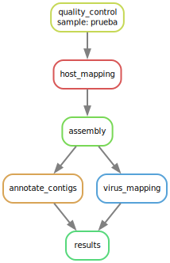

# (Name)


## Introduction

This is the repository of (Name), a pipeline designed for the search of viral sequences in RNAseq samples from human tissues or human related samples. This pipeline was designed used previously developed tools that are available via conda and organized using the snakemake workflow management system. A basic diagram of the pipeline is shown in the next image.

[]

## Installation

```

git clone https://github.com/GerardoCMM/RNAseq-Retinoblastoma.git

cd RNAseq-Retinoblastoma

conda env create -f rna_seq_analysis.yml

```